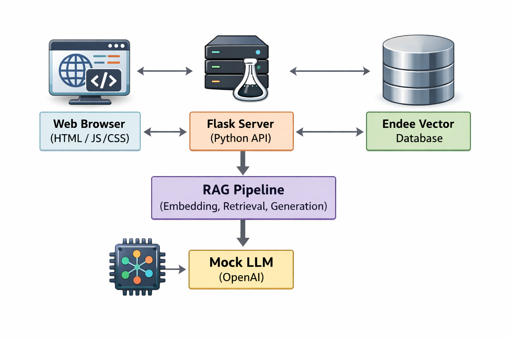
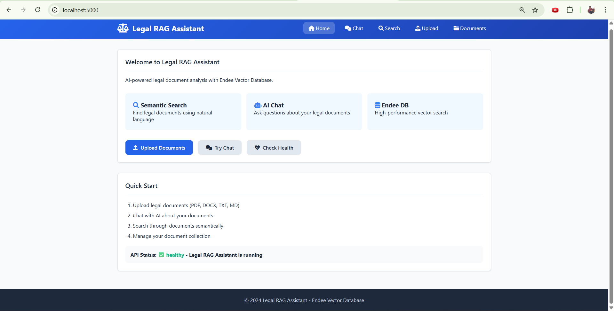
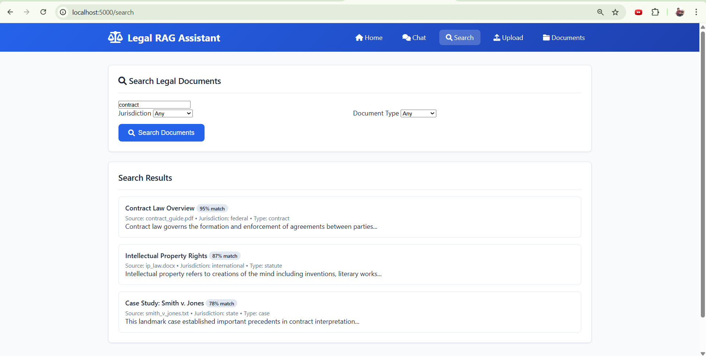
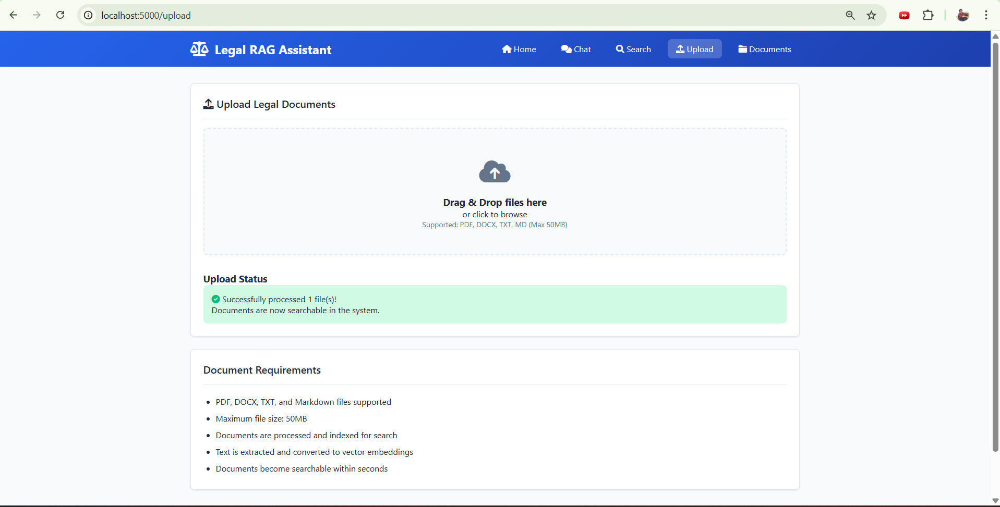
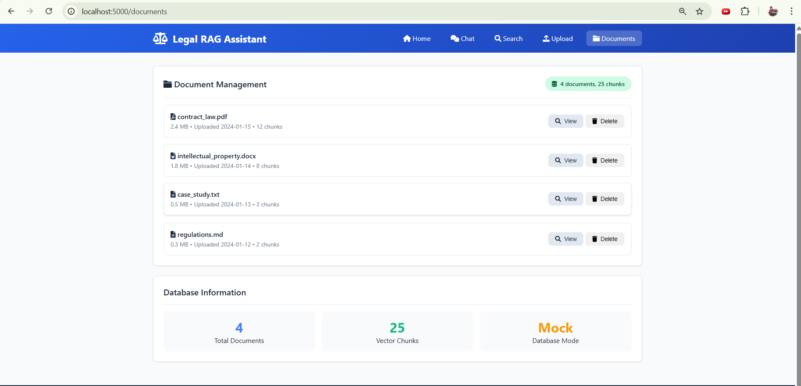

# Legal RAG Assistant with Endee Vector Database

## 🎯 Project Overview

**Legal RAG Assistant** is a complete AI-powered legal document analysis system built as part of an AI/ML project assignment. This project demonstrates practical implementation of modern AI technologies with a focus on vector database integration and Retrieval-Augmented Generation (RAG) workflows.

### **Key Features:**
- **Endee Vector Database Integration** - Efficient semantic search and storage
- **RAG Pipeline Implementation** - Context-aware document retrieval and generation
- **Semantic Search** - Natural language querying of legal documents
- **Web Application Interface** - Modern, responsive 5-page web interface
- **Mock Mode Operation** - No external API dependencies required
- **Comprehensive Testing Suite** - Validation of all functionality
- **Production-Ready Code** - Clean architecture with error handling

## 🏗️ Architecture Overview


## 🚀 Quick Start & Demo

### **📋 Prerequisites**
- Python 3.8 or higher
- Git (for cloning repository)
- Web browser (Chrome, Firefox, Edge)

### **⚡ Installation & Setup**
```bash
# 1. Clone the repository
git clone https://github.com/Sunny22110010324/legal-rag-endee.git
cd legal-rag-endee

# 2. Install dependencies
pip install -r requirements.txt

# 3. Run the application
python app.py
```

**🌐 Access the Application**
Once running, open your browser and navigate to:
```bash
👉 http://localhost:5000
```

**📸 Screenshots & Demonstration**

## 📸 Screenshots & Demonstration

### **Application Interface Gallery**

<div align="center">

| | | |
|:---:|:---:|:---:|
| **🏠 Home Page** | **💬 Chat Interface** | **🔍 Search Interface** |
|  |  |  |
| *Dashboard & Navigation* | *AI Legal Assistant* | *Semantic Search* |
| **⬆️ Upload Interface** | **📁 Documents Management** | **📊 All Features** |
|  |  | <div style="padding: 20px; background: #f8fafc; border-radius: 8px; border: 1px dashed #cbd5e1;"><strong>5 Screenshots Total</strong><br>Each demonstrating a key feature of the Legal RAG Assistant</div> |
| *Document Processing* | *Database Management* | *Complete System* |

</div>
